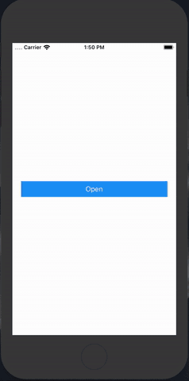
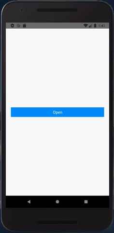

<p>
  <a href="https://github.com/ilkerkesici/react-native-beauty-webview/blob/master/README.tr.md">
    
 </a>
  <a href="https://yarnpkg.com/package/react-native-beauty-webview">
    
  </a>
  <a href="https://www.npmjs.com/package/react-native-beauty-webview">
    
  </a>
</p>

# React Native Beauty Webview for easy usage
## :star2: Features
- Easy usage
- Easy to configure
- Beauty UI
- Default click and copy url
- Open on browser
- See title of website on header

## :star: Screenshot




## :arrow_down: Installation

#### Install react-native-webview
More information about installation of react-native-webview, <a href="https://github.com/react-native-community/react-native-webview/blob/master/docs/Getting-Started.md">click here</a>

```sh
$ yarn add react-native-webview

or

$ npm install --save react-native-webview


```

#### Install @react-native-community/clipboard
More information about installation of clipboard, <a href="https://github.com/react-native-community/clipboard">click here</a>

```sh
$ yarn add @react-native-community/clipboard

or

$ npm install --save @react-native-community/clipboard


```

#### Link native dependencies for IOS
Link native dependencies of @react-native-community/clipboard and @react-native-community/react-native-webview. If your react native verison is lower than 0.60.x, you must check the official documentation of these packages to link correctly.

```sh

$ cd ios && pod install

```
#### Install our package
```sh

$ yarn add react-native-beauty-webview

or

$ npm install --save react-native-beauty-webview

```

## :flashlight: Example Usage
```sh
import React, {useState} from 'react';
import {
  StyleSheet,
  View,
  TouchableOpacity,
  Text,
} from 'react-native';
import BeautyWebView from 'react-native-beauty-webview';

const App = () => {
  const [visible, setVisible] = useState(false);
  const onButtonPress = () => {
    setVisible(true);
  };

  return (
      <View style={styles.container}>
        <BeautyWebView
          visible={visible} // Reguired for open and close
          onPressClose={() => setVisible(false)} // Reguired for closing the modal
          url={'https://github.com/'}
          extraMenuItems={[
            {
              title: 'Extra Item',
              onPress: () => console.log('Extra Menu Item Clicked'),
            },
          ]}
        />
        <TouchableOpacity style={styles.button} onPress={onButtonPress}>
          <Text style={styles.text}>Open</Text>
        </TouchableOpacity>
      </View>
  );
};

const styles = StyleSheet.create({
  container: {
    flex: 1,
    justifyContent: 'center',
  },
  button: {
    alignSelf: 'stretch',
    justifyContent: 'center',
    alignItems: 'center',
    padding: 8,
    backgroundColor: '#2196f3',
    marginHorizontal: 20,
  },
  text: {
    color: '#fff',
    fontSize: 16,
  },
});

export default App;


```
## :paperclip: Config

| Params | Type | Default | Required | Description |
| --- | --- | --- | --- | --- |
| visible | boolean | false | YES | Visibility of modal |
| onPressClose | function | - | YES | Run on press the close button (You must set visibilty as false) |  
| url | string | - | YES | URL of the website |
| backgroundColor | string | #fff | - | Background color of view |
| headerContent | 'dark' or 'light' | 'dark' | - | Content type of header items like icons |
| headerBackground | string | #fff | - | Background of header |
| progressColor | string | #2196f3 | - | Color of the progress bar |
| loadingText | string | 'Loading...' | - | Text of the loading |
| copyLinkTitle | string | 'Copy Link' | - | Text of the copy menu item |
| openBrowserTitle | string | 'Open on Browser' | - | Text of the opening on bowser menu item |
| extraMenuItems | Array | - | - | Extra menu items, you can see detail on usage part on above |
| animationType | 'slide' or 'fade' | 'slide' | - | Animation type of modal |


## :warning: Dependency
### @react-native-community/react-native-webview
You must install @react-native-community/react-native-webview package correctly before use this package. For more information, please <a href="https://github.com/react-native-community/react-native-webview/blob/master/docs/Getting-Started.md">click here</a>
### @react-native-community/clipboard
You must install @react-native-community/clipboard package correctly before use this package. For more information, please <a href="https://github.com/react-native-community/clipboard">click here</a>

## :clipboard: References
#### mxck/react-native-material-menu
For menu component, I took advantages of this resource. More information about this resource, please <a href="https://github.com/mxck/react-native-material-menu">click here</a>
